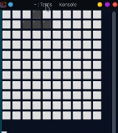

# C++ TETRIS
 I wanted to test my skills by learning a new a lower level language than the ones I'm used to, so I chose C++ and
 a simple game like Tetris to develop.
 This program is intended to be used only on Linux, on Windows devices it will probably not work.

